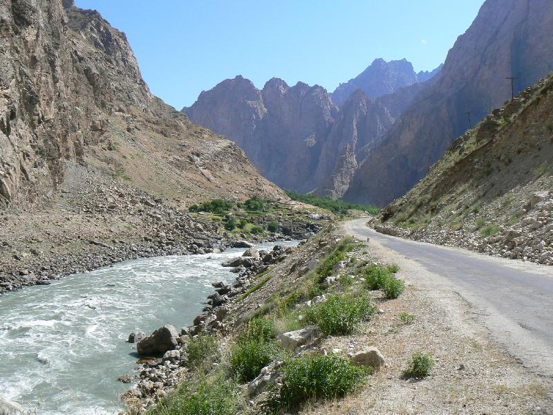
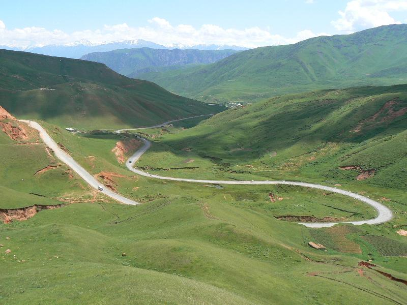
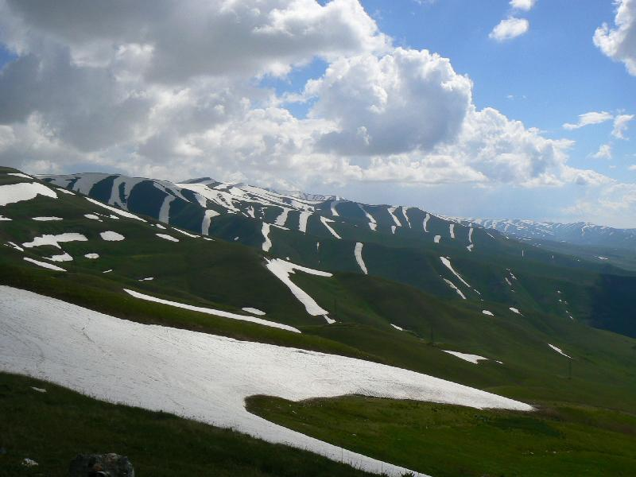

I've upload all of my photos (nearly 700!!!!) so if you're bored head over [here](/bigtrip/gallery/) .  
And here is a taster...

On the left of the river is Afghanistan and on the right Tajikistan

A 3000 meter pass in Kyrgystan

The picture does not do it justice, the red and green were so vivid (Kyrgystan)

Another 3300 meter pass in Tajikistan (between Khorog and Dushanbe)