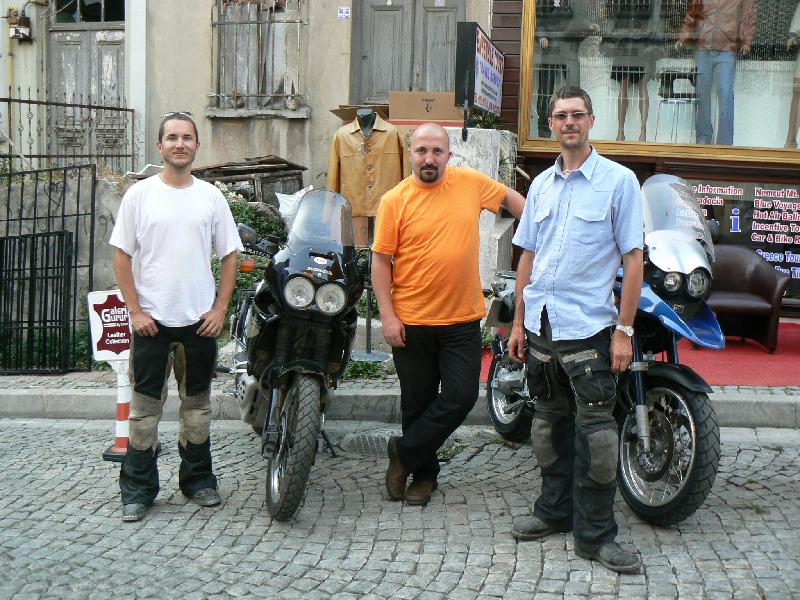

Another picture from the Charyn Canyon, Kazakstan

The Ark (the Emir's palace) walls in Bukara, Uzbekistan

Zindan the city jail in Bukhara, Uzbekistan. Were british officers Stoddart and Conolly were imprisoned in the "Bug Pit" before their ceremonial beheading

A door in the undergound city of Derinkuyu, Cappadocia, Turkey

Decorative ceiling work in the Topkapi palace in Istanbul, Turkey

With Metin Koca of [Ensemble Travel](http://www.ensembletour.com/). Metin was another absolute star that sorted out our bikes and hotel when we got to Istanbul. If you are traveling in Turkey and need a really friendly local Metin is your man.

Breaking the record, 330 miles on a 23 litres of 93 octane fuel - Kyrgystan (Averaging 40 mph on gravel and 50 mpg on tarmac)

PS: I've republished the [photos](/bigtrip/gallery) so it's easier to browse the whole lot in one go