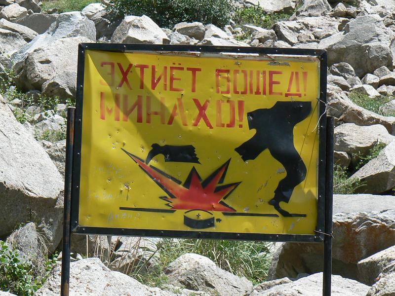
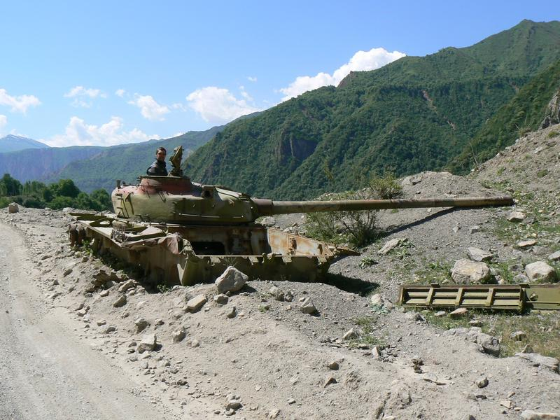

We had forgotten about the land mines until we drove through a military check point and saw an international disposal team on hands and knees clearing mines. Makes one very conscious of the V-Twin rumble.

The road side has quite a few burnt out, old wrecks lying about. Here's two! \[edit: cheeky b&amp;stard! Neil]