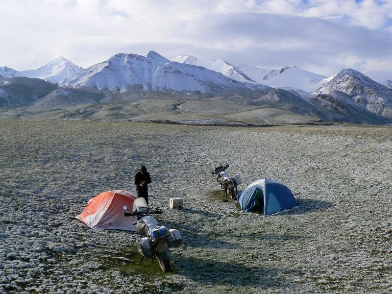
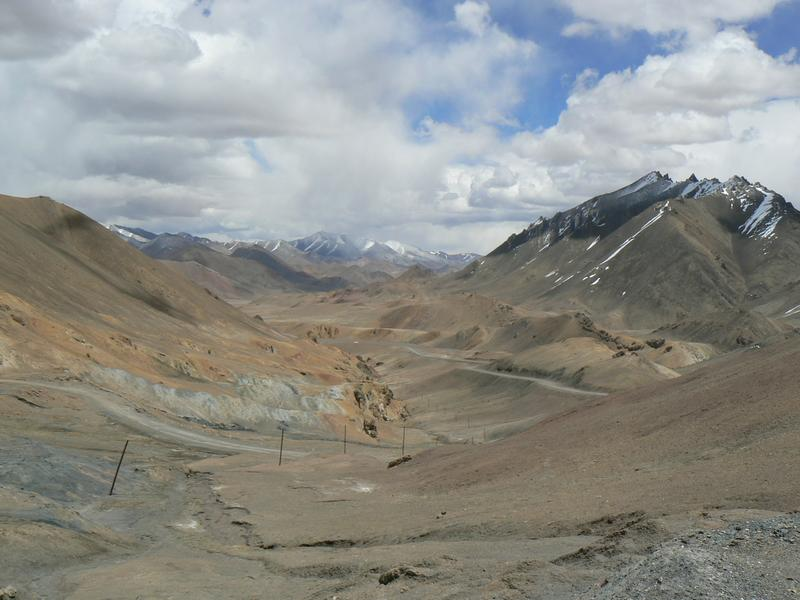
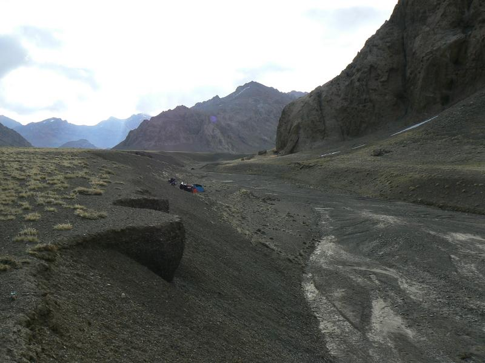
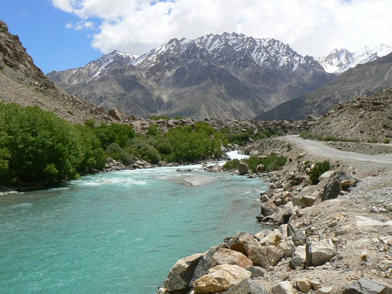

This was actually just before the Tajikistan border at 3600 meters.

This was taken from the highest crossing we did: 4655 meters. We felt some mild effects of high altitude sickness and the bikes power was massively reduced over 4000 rpm.

This is the highest we camped at 4200 meters.

This is the end of the Pamir highway just outside Khorog.