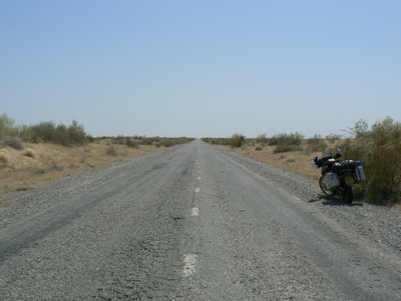

Driving at 70 mph it was still 46 degrees on the bike. In urban areas police check points every kilometer. We made it in two and a half days from Bukhara to Turkmanbashi. But it took 13 hours to get on the cargo ferry for Baku. This was truely the hardest border crossing ever; however bad people say it is, you just can not understand until you have done it.

